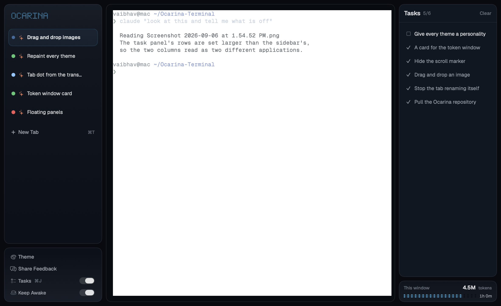
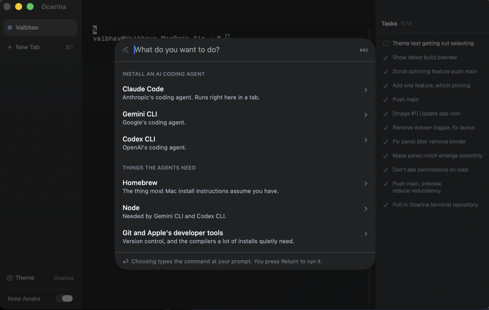
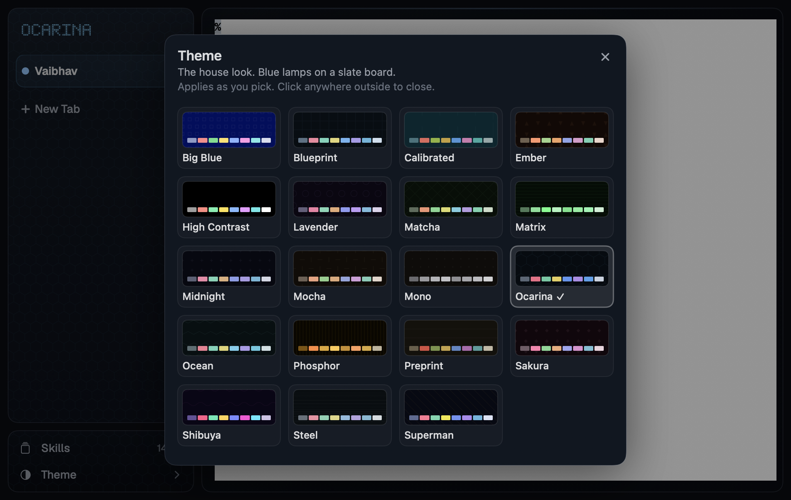
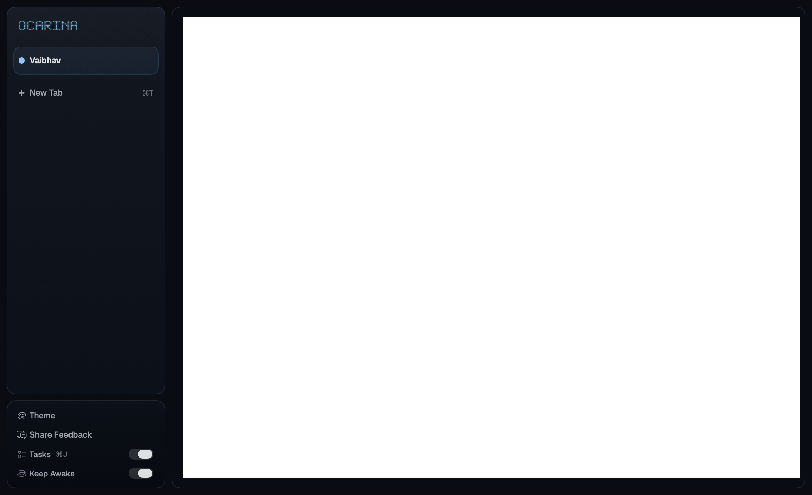

<div align="center">


# Ocarina Terminal

**A macOS terminal for people who were never taught one.**

</div>



A terminal assumes you already know. It opens a blank rectangle, prints a `%`,
and waits. If you know what to type, it is the fastest tool on the machine. If
you do not, it is a locked door with no sign on it — and every instruction you
find for getting through it was written by someone who forgot they ever had to
ask.

Ocarina is the same terminal, built the other way round. It says what it is
doing, keeps the list of what you asked for, offers the command instead of
expecting it, explains the error instead of printing it, takes a file you drag
onto it, tells you what the last five hours have cost, and never runs anything
you did not trigger yourself.

That turns out to matter twice over. The person who has never opened a terminal
needs it because nothing else tells them anything. The person running five
agents at once needs it because five terminals called `zsh` is not a list, it is
a guessing game.

Nothing leaves the machine. Every title, task and explanation is derived
locally, from files the tools already write.

New to this entirely? [Start here](docs/first-terminal.md).

---

## Download

**[Ocarina for macOS](https://github.com/VaibhavVishal07/Ocarina-Terminal/releases/latest)**
— one universal build for Apple Silicon and Intel. macOS 14 or later.

Unzip it and drag `Ocarina.app` into Applications.

**The first launch needs one extra step.** The app is signed ad-hoc rather than
notarised — notarising requires a paid Apple Developer account — so macOS will
refuse to open it and say it cannot check it for malicious software. That is
Gatekeeper telling you the truth: nobody has vouched for this binary but the
person who built it. To open it anyway:

1. Right-click (or Control-click) `Ocarina.app` and choose **Open**.
2. Click **Open** again in the dialog.
3. If macOS still refuses, go to **System Settings → Privacy & Security**, scroll
   to the message about Ocarina, and click **Open Anyway**.

Only the first launch asks. If you would rather do it in one line — in whatever
terminal you have now, since this is the one you are trying to install:

```
xattr -dr com.apple.quarantine /Applications/Ocarina.app
```

Or build it yourself, which needs no permission from anyone:
[Running it](#running-it).

---

## The tabs name themselves

The tab is not called `zsh`. It is called what the terminal is *doing*: the
prompt you gave an agent, the command that is running, the project you are in.

Ocarina reads that from three places, in order of how much they know — the
transcript an agent is already writing, the foreground process on the pty, and
the directory the shell is sitting in. A stability layer decides when a new
answer is good enough to replace the one on screen, so a title does not flicker
every time a command finishes.

An agent conversation is named for the ask that opened it, not for the last
thing typed into it. Reading the newest prompt meant a tab renamed itself on
essentially every command, which is the opposite of what a name is for: you
find a tab by remembering where it is and what it was called. What the agent is
on *right now* is the subtitle, the tooltip and the task panel, all of which are
free to move.

The words themselves come from the same place the task list's do. A word filter
cuts the prompt down the moment it is read, and Claude rewrites it a beat later
— "Toggle option near right-hand" was what the filter made of a tab, and "Move
toggle to right side" is what it is called now. The panel had this and the tab
strip did not, which is why the two columns beside each other read as two
different qualities of the same sentence. One cache and one queue serve both, so
a prompt that appears in the list and on the tab is asked about once.

A dot on each row says idle, running, succeeded or failed, so a column of twenty
can be read down the edge without stopping at any of the names.

For an agent the dot comes from the transcript, not from the byte stream. A
coding agent holds the foreground from launch to quit and repaints its own
input box, status line and cursor while it waits — so "something drew recently",
which is the right test for a shell, is true for the entire life of the tab. A
tab whose job had finished minutes ago sat there blinking *working*, which is
the one distinction the dot exists to draw. `stop_reason: "end_turn"` says it
exactly: the agent has stopped and is waiting for you.

[How the naming works](docs/context-aware-tab-naming.md) — the provider chain,
the priorities and the stability rules.

## It remembers what you asked the agent

You give an agent five things across twenty minutes and cannot remember which of
them it actually got to. The panel down the right is that list, read from the
transcript the agent writes anyway — so it costs the session nothing and it
survives scrollback.

`TaskSummariser` asks Claude to rewrite the local titles, because it is better
at it: "Toggle option near right-hand" becomes "Move toggle to right side".
Three rules follow from where that work happens.

- The local condenser runs first, so a title is on screen immediately and a
  machine with no agent installed loses nothing it had.
- Every prompt is asked about once, ever, cached on disk under a hash of the
  prompt rather than of where it was found — so the tab strip and the task list
  asking about the same sentence cost one call between them. This spends your
  Claude allowance.
- **It waits for a keystroke.** Running the `claude` binary means a subprocess,
  and a subprocess inherits the app's TCC identity — every protected thing it
  reads is asked about in Ocarina's name. Doing it at startup put "Ocarina would
  like to access your Photo Library" in front of someone who had done nothing
  but open a terminal. The first keystroke cannot happen at launch, and it means
  the session is genuinely in use.

The panel is on by default and turns off from a switch in the left column, with
⌘J written beside it. It is a column, not a drawer: showing or hiding it resizes
the terminal once. It was a sliding drawer for a while, and that animated the
terminal's *width* — a `TIOCSWINSZ` and a SIGWINCH per frame, with the shell
repainting its prompt through the whole slide.

Starting something new? The header carries an eraser when there is anything to
erase. It records a line under the list for that project and hides what came
before it. The agent's transcript is not touched — it belongs to the agent, and
deleting somebody's prompts out of Claude's history to tidy a panel would be the
worst kind of helpful. Ask for something new and it appears, being newer than
the line.

The token card's meter is drawn as lamps on a dot-matrix board, in the same
alphabet as the wordmark and the empty state. A departure board is a thing for
counting down, which is what the meter is doing, and the app already owns that
language — so it costs nothing and stops the card looking like every dashboard
tile ever shipped.

Panels stacked one above another share a gradient rather than each running
their own. A column used to go bright, dim, bright, dim — the light restarted
at every card, and the pair read as two objects that happened to be near each
other.

Mirroring the lower card was the first answer and it is wrong in the other
direction: the junction matches, but the column then gets *brighter* on the way
down, which is not what a light source does. So it is one gradient cut in two.
The top card runs from the panel colour to its dark end; the card under it
carries on from that end towards the window's own ground, and the bottom of the
stack is the darkest thing in it. The sheen goes on the top card and only the
top card — a panel halfway down a falling gradient has no reason to catch light
of its own, and putting one there is what made the lower card glow in the
middle of the fall.

## It says what the window has cost

Neither the task list nor this appears until there is an agent in front of you.
Both are about a conversation, so a shell at a prompt has nothing to put in
either; the column used to open on launch regardless and say "No tasks yet" to
somebody who had not started an agent and had no way to know that was the point.

Under the task list, a small card: tokens spent in the five-hour window this
agent is inside, and how long that window has left to run. A label with its
value on the same line and a meter under it — the meter drawn as ticks rather
than one filled capsule, because a solid bar reads as a proportion of something
continuous and invites exactly the reading this card must not invite. The ticks
are counted units and they really are counted: the window in quarter-hours, of
which some have gone. It is there only
while the tab in front is running an agent — a shell at a prompt is not having
a conversation — and the same reading sits in the menu bar beside the Wi-Fi,
for when Ocarina is not the window you are looking at.

It says **used**, not **left**, and that is not a hedge. Nothing on the machine
records the size of the allowance or when the account's quota renews: not
`~/.claude.json`, whose two rate-limit tier fields are null; not the session
files; not the transcripts, which carry no rate-limit record of any kind. That
number exists only in the responses Anthropic sends back, and the only way to
ask for it would be to take the OAuth token out of the user's home directory
and spend it on a request they did not make. A terminal does not get to do
that, so the card shows what can be shown honestly. A meter with a denominator
invented for it would be worse than no meter.

The window itself is reconstructed from the timestamps, which the transcripts
do record: a block opens on the first request made after the last one lapsed
and runs five hours — from the *top of the hour* that request landed in, which
is where the account puts the boundary. Counted from the timestamp itself the
card was up to an hour late: it went on filling a block the account had already
renewed, so a limit that had just reset was reported as a window nearly out of
time. And once a block has been established it is kept until the clock ends it,
rather than re-derived on every poll — the reading only looks back ten hours, so
a chain rebuilt from whatever is still inside that window moves under a user who
has done nothing.

Tokens are counted once each — what was sent, what was written to cache, what
came back. Cache *reads* are left out on purpose: they are the same tokens being
read back, already counted on the turn that wrote them, and adding them charges
a long conversation for its whole context on every single turn.

## It tells you what to type



⌘K opens a drawer of recipes — install an agent, install the things agents
assume you already have. Each one says what it does before you choose it.

It does not run anything. Choosing a recipe **types** its command at the prompt
and leaves the cursor after it, so the last act is always yours. That is
deliberate on two counts: nothing executes that you did not trigger, and you see
the command each time, which is how you eventually stop needing the drawer at
all.

Recipes live in `Sources/OcarinaUI/Resources/Recipes/`, extended from
`~/.ocarina/recipes/`.

## It reads a paste before the shell does

The most dangerous thing a beginner does in a terminal is paste something from
the internet. ⌘V goes through `PasteInspector` rather than straight to the
emulator.

Anything unremarkable is pasted with no ceremony, because a terminal that
interrupts every paste is one people learn to click through. Only multi-command
or risky text stops for review, with a line on each part saying what it will do.

Prose is never multi-command, whatever line breaks are in it. Dictation arrives
as a paste — Wispr Flow inserts what you said the moment you let go of the key
— and a spoken paragraph was being met with "this is 4 separate commands, not
one". A line has to read as something a shell would run before the count
against it means anything. Text that can destroy something is still called out
however it arrives.

## You can drop a file on it

A path is the worst thing to type and the easiest thing to drag. Drop a file
onto the terminal and its path lands at the prompt, quoted if it needs to be,
with a space after it so you can carry on typing.

An image that has no file behind it — dragged off a web page, out of a message,
straight from a screenshot — is written out to a real file first, so there is
still a path to hand an agent. Terminal.app rejects those.

While you are over it the panel dims, a dashed box appears, and it says what
letting go will do: *the file's location is typed at the prompt, nothing is
uploaded and nothing runs.* That is the web gesture, not the native one — a
native app draws a two-point focus ring and says nothing, which is fine if you
already know that terminals take files and what they do with them. Nobody
arriving at this app knows either.

Then the path lands, and that is the whole of it. A chip under the prompt was
built — thumbnail, name, and an × that took the path back off the line — and it
was one thing too many: the path is already there, in the place you are about
to press Return on, so a second widget saying the same thing is furniture. The
overlay stays because it is the part that teaches. The receipt was never
needed.

## It explains what just broke

A command fails and prints something the person who ran it cannot read. For the
user this app is for, that is not an inconvenience — it is where the session
ends, because there is nothing they can do next.

Ocarina already knows the command failed and what is on the screen, and an agent
is usually installed a tab away. A banner offers to hand the exit code and the
visible screen to whichever of `claude`, `gemini` or `codex` is present.
Dismissing it means "I have read this one", not "stop telling me when things
break" — the next failure brings it back.

## It asks you what went wrong

A row under Theme opens a sheet. Say what is broken, and it either opens a
prefilled issue on this repository or copies the same report for whatever
channel you actually use. Your build and macOS version are appended, which are
the two facts every report needs and nobody remembers to include.

It composes; it does not send. There is no server behind Ocarina and no key in
the app, so anything that "just sent" would either be posting to a third party
you never agreed to or shipping a credential inside a binary anyone can
download. It also asks for no address: an earlier version opened a `mailto:`,
which quietly demanded both a configured mail client and the reporter's own
identity attached to a complaint. Neither is fair to ask of somebody whose whole
contribution is telling you a button is broken.

## Four panels, floating

The tab list, the settings, the terminal and the task panel are separate cards
with the window's own ground between them, sitting under a real titlebar with
nothing written in it — Apple Notes and Chrome hold their panes the same way.

The sidebar was one card with the settings drawn as an inset box inside it — a
card in a card, a shape used nowhere else in the window. The right-hand column
had already answered this, with the task list and the token widget as two
panels and the ground between them, so the left-hand side now answers it the
same way. Four panels of one kind beats three and a nested one.

It was one unbroken surface running up under a hidden titlebar, which meant
every edge had to clear a bar that was not drawn: a spacer in the sidebar, an
inset in the terminal, thirty points of padding on the error banner, and three
traffic lights floating on the tab list. The bar earns its place — somewhere to
hold the window that is not the text you are reading — and the gap around the
cards does the rest.

The terminal's scroll indicator only appears while you are scrolling. SwiftTerm
puts a bare `NSScroller` in the view rather than one inside an `NSScrollView`,
and an overlay scroller only knows to fade out because a scroll view tells it
to — so it drew a permanent knob down the right-hand edge, over text, in a
window with no other always-on furniture in it.

## It looks like something you chose



Fourteen bundled themes, applied as you pick. Each is a JSON file carrying the
chrome colours, the terminal bed and a sixteen-colour ANSI palette. Drop your own
in `~/.ocarina/themes/` and they appear beside the bundled ones.

They used to be one theme with different wallpaper. The terminal palettes had
always carried real colour; the *chrome* did not — panels at 5–30% saturation
read as near-black whatever hue was nominally in them, four themes drew their
borders and row washes in pure white, and the house theme had no hue at all.
Every panel, edge, wash, accent and text weight is now mixed from the theme's
own hue.

Getting there took four goes and two of them are worth recording. Adding hue at
the old lightness changed nothing you could see. Raising the *lightness* fixed
that and broke something better: panels at 19% are not a dark theme any more.

Colour at low lightness comes from saturation, not from light — a panel at 10%
lightness and 34% saturation is a navy or a wine, unmistakably that colour and
*darker* than the grey it replaced. The fourth pass is the same idea with the
volume down, because "enough saturation to see" and "as much as the formula
allows" are not the same number and the third pass reached for the second one.
A panel should read as a dark room with a colour in it, not as the colour:

    ground   3%      the window, behind everything
    bed      5%      the terminal card
    panel   7-10%    the sidebar, the task list, the settings

The terminal ramp gets the twelve-degree hue pull and nothing else — no
saturation or lightness push. Sixteen colours turned up together is the largest
bright surface in the window, and it was the other half of what made the set
feel lit rather than dark.

`terminal.background` is now set to what is genuinely behind the text — the bed
composited over the ground at the bed's own opacity — rather than to a colour
nothing draws. It is the number the legibility floor measures against, so the
floor now guards what the eye is actually reading.

The selected tab wears the accent, fill and edge, at 11% and 34% — enough to
say which theme you are in, not enough to be the brightest thing on screen. It
was a white-ish wash under a white-ish border, which is the same faint grey
rectangle in all fourteen themes, on the one row you look at most.

Ten of the fourteen also shipped the *same* sixteen terminal colours, so `git
status` came out identical whichever you picked — which is most of why the set
felt flat. Each ramp is now pulled towards its theme's hue, and pulled by no
more than twelve degrees. That cap is the whole lesson of the first attempt: a
fraction of the way round the wheel takes the shortest path, and from red to a
blue theme the shortest path runs backwards through magenta. Twenty per cent of
it landed on pink, and yellow landed on red — a theme whose "yellow" output
printed in the colour its errors print in. Twelve degrees is a family
resemblance that cannot be misread as a different colour; the rest of the
character comes from saturation and lightness, which carry no meaning to break.

Every colour is then checked against the reading floor and lifted until it
clears — turning saturation up takes light out of a colour, and one theme's dim
grey, which is where comments land, fell to 4.38 against a floor of 4.5.

Themes used to carry a background motif as well — petals, leaves, embers, rain.
Read at one row it was texture; read down a column of tabs it was litter behind
the thing you were trying to scan. It is gone from the renderer and from the
format, because a field left in the format is a promise to keep drawing it.

Body text is white with a *tinge* of the theme, not the theme's colour set as
words — and that is a ceiling rather than a rule about how much hue to add.
Thirteen of the fourteen were already written that way, at a chroma between
0.01 and 0.13; Matrix was the exception at 0.41, and its screen was the one
where the text *was* the theme rather than wearing it. Anything above 0.14 is
pulled towards the grey of its own luminance until it sits at the ceiling, so
Matrix's `#8CF5A3` is drawn as `#BFE2C6` and the other thirteen come through
untouched. The two whites in the palette answer to the same ceiling, because
they are the text colour in every bundled theme, and capping one without the
other would leave a program printing in white louder than the line above it.
Anyone's own theme gets this too, which a hand-edited palette would not have.

A theme also reaches inside the programs the terminal runs. Setting the sixteen
ANSI colours used to be the whole of a palette, and it is not how the tools
people run colour themselves any more: Claude Code names its gold outright,
`38;5;220`, and no theme can touch a colour named in full. Choosing Matrix and
opening an agent gave you a green window with a gold program sitting in it.

Sending every such colour to its nearest slot fixes that and breaks something
worse. Against a theme built around one hue — Matrix, whose palette's "yellow"
is a green — an agent's gold chrome and its added lines both came back green,
and *added* against *removed* is the one distinction in a terminal you cannot
afford to lose. So the rule is narrow, and it is about what a colour is for:

- **Red and green are left exactly as the program sent them.** They are the two
  colours that carry meaning rather than decoration — failed and passed, removed
  and added — and a theme does not get a vote on those.
- **A program's own accent is toned down to plain text.** The gold is branding:
  the loudest thing on the screen, saying nothing the words beside it do not.
  Plain text means the theme's foreground *with the hue taken out* — near-white
  on a dark theme, near-black on a light one — and not the foreground itself,
  which is not neutral in every theme: Matrix sets it to `#8CF5A3`, so an accent
  handed the text colour came out bright green, which is a long way from toned
  down. The way to stop a colour shouting is to give it no hue at all. As a
  *background* it keeps a hue — a warm bar is a marked row, a white one is
  nothing.
- **The cool hues take the theme's own — unless the theme answers with a red or
  a green.** Blue, cyan and magenta are where a TUI draws its furniture, and
  furniture is decoration. But the colour Claude Code paints the *selected*
  option of a yes/no prompt in is that pale blue, and Matrix answers "blue"
  with `#8AF0A5` — so "No, exit" came up green, a negative call to action
  wearing the colour of go. The theme's answer is checked before it is given:
  a recolour may change how decoration looks, never what it appears to mean.
- **Greys are left alone.** A grey is already neutral, so there is nothing in it
  for a theme to answer, and answering anyway is how a program's quiet secondary
  text came back faintly green, or faintly pink.

The eight ANSI colours and their bright variants pass through untouched — those
were already the theme's to answer. The ground is its own case: a program
painting its background the colour of the terminal's is asking for the
background, so it gets the *default* one and the window's glass shows through,
rather than an opaque slab of the theme's black. A switch under the swatches
turns the whole thing off.

The picker is not a sheet. A sheet on macOS is modal and will not dismiss on a
click outside it, and picking a theme is a thing you do by trying three and then
getting on with your work.

Choosing a theme also sets `NSApp.appearance`. System controls — the keep-awake
switch, the menus, the window's own furniture — draw themselves and take their
cue from `NSAppearance`, not from us; without this a light theme kept a dark
switch and dark scrollbars, which reads as a half-finished theme rather than a
choice.

Text is Geist and Geist Mono, bundled under the OFL and registered before the
first frame draws, so nothing flashes through a fallback face on its way to the
right one.

## It stays awake while you wait

Ocarina holds a `PreventUserIdleDisplaySleep` assertion — the same one
`caffeinate -d` takes — for as long as it is open. It is **on by default**: a
terminal is usually waiting on something long, and a display that sleeps through
the build is never what was wanted. The point is to stop needing a `caffeinate`
parked in a spare tab.

The switch in the sidebar says whether the assertion is actually held, and
toggles it. `isHolding` is tracked separately from `isEnabled` because the
system can refuse an assertion, and the switch must not claim the Mac is being
kept awake when it is not.

The assertion is named, so it is never a mystery which app is doing this:

```
$ pmset -g assertions
   pid 62530(Ocarina): [0x0001ec3a00058822] PreventUserIdleDisplaySleep named: "Ocarina is open"
```

The kernel drops a process's assertions when it exits, so quitting Ocarina
always gives it back, including on a crash.

## And when there is nothing open



Close every tab and the window is given over to a dot-matrix panel: a wordmark,
one lit call to action, and the two shortcuts that still mean something with no
terminal open.

It borrows the look of an airport departures board but not its furniture. A
clock, gate numbers and an ON TIME column are what such a board carries because
a flight has a time and a status; a terminal that does not exist yet has
neither, so drawing them was decoration dressed up as information. What earns
its place is the matrix itself.

The same alphabet carries the wordmark at the top of the sidebar, small and lit,
so the window wears its mark whether or not there is a terminal open. Its lamps
are brighter than the theme's accent on purpose: the accent's lightness is
right for a border and wrong for a lamp, and derived from it directly the mark
came out the dimmest thing on the panel. The
titlebar's own "Ocarina" is hidden to make room for it — otherwise the window
wore its name twice, ten points apart.

`DotMatrix` carries a 5x7 font and paints **every** cell of the grid, dark when
it is off. That is the whole character of the thing: the unlit dots stay visible
behind the words, so the text reads as lamps that happen to be on rather than as
glyphs floating on black. Characters are five cells wide with one blank column
between them, so padding two strings to the same length is all it takes to make
their columns line up.

---

## Running it

```
swift build
swift test
swift run Ocarina
```

`swift run` is fine for development, but it runs unbundled: generic icon, no
Finder integration. For the real thing:

```
Scripts/make-app.sh          # release -> build/Ocarina.app
Scripts/make-app.sh debug    # a separate "Ocarina Test Build.app"
open build/Ocarina.app
```

The debug build is a *separate app*, not the same one rebuilt: its own name,
bundle identifier and executable name. Sharing any of the three meant Launch
Services, the Dock and ⌘-Tab could not tell a test build from the installed one.

One behaviour differs between bundled and not. A binary run from a shell
inherits that shell's directory, so tabs opened where you were; an app launched
from Finder inherits `/`, and every new tab opened at the root of the disk and
was named for it. A session with no directory of its own starts at home.

## Keyboard shortcuts

| | |
|---|---|
| ⌘T | New tab |
| ⌘W | Close tab |
| ⌘K | Quick actions |
| ⇧⌘P | Command palette |
| ⌘J | Show or hide the task panel |
| ⌘V | Paste, through the inspector |

They come from the menu bar in `MainMenu`, not from SwiftUI
`.keyboardShortcut`. AppKit offers a key equivalent to the main menu before the
event reaches the window or the responder chain, so a menu item always gets it;
a hidden SwiftUI button only sees what makes it as far as the view hierarchy,
which a terminal view holding first responder can swallow. Ocarina had no main
menu at all for a while, which is why ⌘W did nothing — and why ⌘Q didn't either.

The Edit menu's cut and copy have no target, so they travel the responder chain
to SwiftTerm, which implements them.

---

# How it is built

## Package layout

`OcarinaTerminalContext` is the naming subsystem. It holds no PTY state and does
no rendering — it takes a `TerminalSessionSnapshot`, asks each provider what the
terminal is doing, and folds the strongest answer into a `TabContext`.

```
Sources/OcarinaTerminalContext/
  ContextSource.swift            priority chain: shell < project < command < llm < manual
  ContextObservation.swift       one provider's reading, with a confidence
  TabContext.swift               per-tab naming state; displayTitle / subtitle
  TabActivity.swift              idle / running / succeeded / failed, for the dot
  TabNamingEngine.swift          the stability rules (dwell, margin, no demotion)
  TabContextCoordinator.swift    actor that runs the provider chain per tab
  TitleFormatter.swift           local text -> 2-4 word title. No model, no network.
  Providers/
    LLMSessionContextProvider    shared agent provider: Claude / Codex / Gemini / OpenCode
    ClaudeTranscriptSource       ~/.claude/projects/<slug>/*.jsonl
    CodexTranscriptSource        ~/.codex/sessions/**/rollout-*.jsonl
    AgentTaskSource              the same transcripts, read as a to-do list
    GenericProcessContextProvider foreground argv -> title
  Session/
    ProcessInspector             tcgetpgrp + sysctl: what owns the pty right now
    OSCParser.swift              streaming ESC ] 0;title BEL reader
    PTYProcess.swift             forkpty, resize, and the environment scrub
    ShellIntegration.swift       the env a spawned shell is given
    TerminalSessionMonitor       one pty -> TerminalSessionSnapshot
    TabNamingService             poll loop; publishes tabs whose title changed
```

Wiring a tab:

```swift
let service = TabNamingService()
await service.attach(TerminalSessionMonitor(ptyDescriptor: primaryFD, shellName: "zsh"))
await service.start()

for await tab in await service.updates() {
    sidebar.rename(tab.tabID, to: tab.displayTitle, subtitle: tab.subtitle)
}
```

The renderer can forward the bytes it already reads to `monitor.ingest(_:)` so
programs that set their own title are picked up; nothing else is read from the
terminal.

```
Sources/OcarinaUI/       SwiftUI layer
  OcarinaWindowView      the window: sidebar, terminal, task panel
  OcarinaModel           open tabs, selection, renames, title updates
  TerminalSession        one tab: pty + SwiftTerm view + naming monitor
  TabSidebarView         tabs as tasks, with the theme and keep-awake footer
  TaskPanelView          what you have asked the agent in this tab
  TaskSummariser         better names for those tasks, via the `claude` binary
  ThemeStore / Theme     bundled + user themes, and the colour model
  ThemePickerView        pick by looking, not by remembering names
  CommandPaletteView     jump by what a terminal is doing (⇧⌘P)
  QuickActionsView       recipe drawer (⌘K); types, never runs
  PasteInspector         reads a paste before the terminal does
  ErrorHelp              hand a failure to an installed agent
  EmptyStateView         no tabs open: the departure board
  DotMatrix              5x7 dot-matrix panel, the board is built from it
  OcarinaIcon            the bundled app mark, prepared for the dock
  FeedbackView           the report sheet, and the issue URL it builds
  ClearedTasks           the per-project line under the task list
  PackagedResources      finds the resource bundle inside a built .app
  Theme / ThemeColor     the colour model a theme file decodes into
  Recipe                 the quick-actions catalogue
  ErrorBannerView        what a failed command puts on screen
  PasteReviewView        the sheet a risky paste stops at
  TactileClick           the click a switch makes
  AppIdentity            what this build calls itself
  TabIcon / StatusDot    a symbol and a state for each tab
  SleepGuard             holds the Mac awake while Ocarina is open
  BundledFonts           registers Geist before the first frame
  MainMenu               the menu bar; where ⌘T / ⌘W / ⌘K / ⇧⌘P actually live
  ToolTip                AppKit tool tips, because .help draws none here
Sources/Ocarina/         executable entry point
```

SwiftTerm is used only as the VT parser and screen grid. Ocarina spawns the pty
itself, via `forkpty`, because `login_tty` is what makes the pty the child's
controlling terminal — and without that `tcgetpgrp` reports nothing and the
naming layer is blind.

### Where the resources have to live

SwiftPM generates a `Bundle.module` accessor for `OcarinaUI` that looks in
exactly two places: `Bundle.main.bundleURL/Ocarina_OcarinaUI.bundle` — the root
of the `.app` — and the absolute `.build` path baked in when it compiled.

Neither is usable. The bundle root cannot hold the resources, because `codesign`
refuses to sign a bundle with anything loose at the top (`unsealed contents
present in the bundle root`), and a symlink there is refused for the same reason.
So they are sealed in `Contents/Resources` and `PackagedResources` looks for them
there, keeping `Bundle.module` as the fallback that `swift run` and the tests use.

This is worth knowing because getting it wrong is invisible on the machine that
built the app: the second candidate is a real path on that disk, so it loads and
everything works, while every downloaded copy dies on launch. `make-release.sh`
fails the build if the bundles are missing from the app, and the only honest way
to check by hand is with `.build` moved away entirely.

## The child environment

A terminal inherits the environment of whatever launched it, and passes it to
every shell it spawns. Launched from inside another tool's session that means
handing each shell the identity of that session — nested tools then believe they
are running as a child of their own parent, which is why Claude Code reported
that transcript saving was off. One of the inherited variables is a messaging
token, which has no business reaching an arbitrary shell.

`PTYProcess` drops those markers before the fork. Only session identity goes:
credentials and configuration a user exports for their own use are theirs and
are left alone.

## Icons and glass

The app icon is `Icons/AppIcon.png`. **Run `Scripts/make-app.sh` to get it.**

A bare SwiftPM executable has no bundle, so macOS has nowhere to read an icon
from and falls back to the generic Unix-executable picture. Setting
`applicationIconImage` is the only lever without a bundle and it does not reach
Finder, the app switcher or Get Info — which is why `swift run Ocarina` still
looks generic. The script assembles a real `Ocarina.app`: an `Info.plist`, an
`AppIcon.icns` generated from the PNG, the SwiftPM resource bundles, and an
ad-hoc signature.

`OcarinaIcon` trims the art to its drawn content, clips the corners to
transparency and lays it on a clear canvas at the ~80% the macOS icon grid
expects. That preparation exists because an earlier icon was an opaque black
plate with the tile drawn inside it: used as-is it made the dock icon read as a
small tile in a dark square. The invariant worth keeping is that preparation
adds margin around the art and never eats into it. A 512px plate that came back
as a 424px icon is the regression that invariant was written against; the test
pins the invariant — prepared is wider than the art it was given — not the
number.

Tabs do **not** use the app icon. Every tab carrying the same picture said
nothing; `TabIcon` gives each one a symbol for its foreground process, so Claude
Code reads differently from a shell at a prompt across a sidebar of twenty.

Glass needs something behind it to blur. An `NSVisualEffectView` sits behind the
hosting view and the window is non-opaque, so the materials in the chrome have
the desktop to work with; without it they resolve to flat grey. The terminal
view's own background is cleared and a themed bed sits behind it — the glass
reads through, and the text stays legible.

## Tool tips

A tip is taken down when the control it explains is *removed*, not only when
the pointer leaves it. The close button on a tab exists only while its row is
hovered, and a view taken out of the tree never receives `mouseExited` — so
leaving a row briskly deleted the button while its "Close this tab (⌘W)" was
up, and nothing was left to retract it. It sat there until some other control
happened to replace it. Every control that can vanish under the pointer has the
same problem, which is why the fix is in the modifier rather than in the tab
row.


Three mechanisms were tried. SwiftUI's `.help` produces nothing in a plain
`NSHostingController` — walk the view tree and there is no tool tip on it at
all. AppKit's `NSView.toolTip` *is* installed, on a view that hit-tests at the
right frame, and still never appears: the tool tip manager needs mouse-moved
events to reach the view under the cursor, and inside a hosting view they do not
arrive. A SwiftUI bubble drawn by the control itself is then clipped away by the
scroll view the tabs sit in.

So a control only reports hover, through a tracking area on the small `NSView`
that already takes its click, and the sidebar draws the bubble in its own
coordinate space — outside the scroller, and above the terminal by `zIndex`.

Tab titles are capped at 24 characters for display, ellipsis included, so one
long name cannot push the sidebar around. The tab keeps its full name for
renaming, for the hover subtitle and for the command palette.
